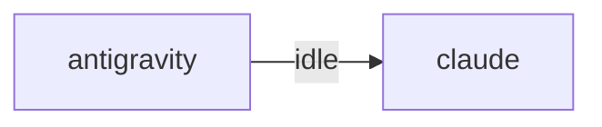

# HiveMind Status

Updated: `2026-08-16 00:13:52`

## Current Focus
No open plan tasks remain.

Alignment: Plan has no open tasks, but the workspace still has changes: .ai_monitor/vibe-view/dist/assets/floatingwindow-biisa3d2.js, .ai_monitor/vibe-view/dist/assets/index-d-a_6_g_.css, .ai_monitor/vibe-view/dist/assets/index-yi4kgzk7.js, .ai_monitor/vibe-view/dist/assets/officeapp-ccs-_uwo.js, .ai_monitor/vibe-view/dist/index.html (+55 more). Update ai_monitor_plan.md if this work is intentional.
Changed files:
- .ai_monitor/vibe-view/dist/assets/floatingwindow-biisa3d2.js
- .ai_monitor/vibe-view/dist/assets/index-d-a_6_g_.css
- .ai_monitor/vibe-view/dist/assets/index-yi4kgzk7.js
- .ai_monitor/vibe-view/dist/assets/officeapp-ccs-_uwo.js
- .ai_monitor/vibe-view/dist/index.html
- .ai_monitor/vibe-view/src/lib/browservoice.ts
- .ai_monitor/vibe-view/src/lib/voicebus.ts
- .ai_monitor/voice-server/engines/tts_cosyvoice.py
- ... and 52 more

## Agent Flow

## Recent Thought Stream
- No recent thought records found.

## Debate Ledger
- No debates recorded yet.

## Data Warnings
- psycopg2 query failed: relation "hive_debates" does not exist
LINE 3:         FROM hive_debates
                     ^

- ERROR:  relation "hive_debates" does not exist
�� 2:         FROM hive_debates
                  ^
- psycopg2 query failed: relation "pg_messages" does not exist
LINE 3:         FROM pg_messages
                     ^

- ERROR:  relation "pg_messages" does not exist
�� 2:         FROM pg_messages
                  ^

---
> This file is generated by `scripts/generate_hivemind_doc.py`.
