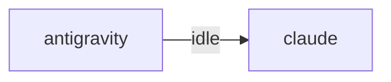

# HiveMind Status

Updated: `2026-07-19 22:05:27`

## Current Focus
Open plan tasks:
- Task 1: server.py `_switch_project(path)` 구현
  방법: ① dir 검증 ② last_path 저장 + projects.json MRU ③ _pg_conn_lock 안에서
  _init_project_db(새슬러그)(DB 생성+set_project_db+커넥션리셋) + ensure_schema
- Task 2: POST /api/switch-project 라우트 등록
  파일: server.py POST 라우트 테이블
  방법: {path} 받아 _switch_project 호출, JSON 반환.
- Task 3: zettel_sync 매 사이클 project/vault 재해석
  파일: infra/daemons.py run_zettel_sync
  방법: _proj_id/_vault/_old_vault 해석을 루프 밖→루프 안으로 이동(또는 콜러블 재호출).
- Task 4: App.tsx openFolder → switch-project 호출
  파일: vibe-view/src/App.tsx
  방법: select-folder 성공(+prompt 폴백) 후 POST /api/switch-project 호출 →
- Task 5: 로컬 검증
  방법: dev 서버에서 switch-project 정상/롤백/없는경로 케이스 + py_compile/ruff/tsc.
  검증: 케이스 통과.

Alignment: Current work aligns best with Task 4: App.tsx openFolder → switch-project 호출. Matched files: .ai_monitor/api/dashboard_api.py, .ai_monitor/api/git_api.py, .ai_monitor/api/hive_api.py, .ai_monitor/api/office_launch_api.py, .ai_monitor/api/office_proxy_api.py. Unmatched changes still present: .ai_monitor/infra/cli_commands.py, .ai_monitor/infra/lifecycle.py, .ai_monitor/infra/postgres_runtime.py, .ai_monitor/infra/pty_process.py, .ai_monitor/infra/runtime.py (+4 more).
Changed files:
- .ai_monitor/api/dashboard_api.py
- .ai_monitor/api/git_api.py
- .ai_monitor/api/hive_api.py
- .ai_monitor/api/office_launch_api.py
- .ai_monitor/api/office_proxy_api.py
- .ai_monitor/api/tools_api.py
- .ai_monitor/data/config.json
- .ai_monitor/infra/cli_commands.py
- ... and 11 more

## Agent Flow

## Recent Thought Stream
- No recent thought records found.

## Debate Ledger
- No debates recorded yet.

## Data Warnings
- psycopg2 query failed: relation "hive_debates" does not exist
LINE 3:         FROM hive_debates
                     ^

- ERROR:  relation "hive_debates" does not exist
�� 2:         FROM hive_debates
                  ^
- psycopg2 query failed: relation "pg_messages" does not exist
LINE 3:         FROM pg_messages
                     ^

- ERROR:  relation "pg_messages" does not exist
�� 2:         FROM pg_messages
                  ^

---
> This file is generated by `scripts/generate_hivemind_doc.py`.
