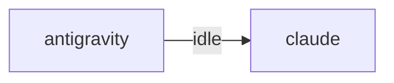

# HiveMind Status

Updated: `2026-08-08 21:47:16`

## Current Focus
Open plan tasks:
- Task 1: CNAME 교체 + Pages 커스텀 도메인 변경
  파일: web/CNAME
  방법: btsky.pe.kr → www.btsky.pe.kr. 커밋·푸시로 Pages 워크플로 재배포 후
- Task 2: 내부 절대경로·메타태그 정리   (의존: Task 1)
  파일: web/index.html, web/site.js, web/*/index.html
  방법: og:url·canonical·하드코딩된 https://btsky.pe.kr 를 www 로 교체.
- Task 3: apex A레코드 전환   (의존: Task 1 검증 통과 · 🙋 M1)
  파일: 없음 (운영 작업)
  검증: dig btsky.pe.kr 이 158.247.205.192 단독. www 는 계속 Pages 정상.
- Task 4: 인증서 발급 + 리다이렉트 규칙   (의존: Task 3)
  파일: apix-console/deploy/nginx-apix.conf (신규)
  방법: certbot -d btsky.pe.kr -d admin.btsky.pe.kr (기존 인증서에 SAN 추가).
- Task 5: apix-console private 리포 생성
  파일: (신규 리포) apix-console/
  방법: gh repo create --private. 구조 = console/(프론트) collector/(수집)

Alignment: Current work aligns best with Task 1: CNAME 교체 + Pages 커스텀 도메인 변경. Matched files: .ai_monitor/vibe-view/dist/assets/floatingwindow--ho84gjj.js, .ai_monitor/vibe-view/dist/assets/floatingwindow-0s1b6f_d.js, .ai_monitor/vibe-view/dist/assets/floatingwindow-9xjfhv3b.js, .ai_monitor/vibe-view/dist/assets/floatingwindow-b1l-pjxp.js, .ai_monitor/vibe-view/dist/assets/floatingwindow-b3fcsmgf.js. Unmatched changes still present: .ai_monitor/infra/daemons.py, .ai_monitor/src/pg_central.py, hivemind.md, project_map.md, tests/test_tunnel_daemon.py.
Changed files:
- .ai_monitor/infra/daemons.py
- .ai_monitor/src/pg_central.py
- .ai_monitor/vibe-view/dist/assets/floatingwindow--ho84gjj.js
- .ai_monitor/vibe-view/dist/assets/floatingwindow-0s1b6f_d.js
- .ai_monitor/vibe-view/dist/assets/floatingwindow-9xjfhv3b.js
- .ai_monitor/vibe-view/dist/assets/floatingwindow-b1l-pjxp.js
- .ai_monitor/vibe-view/dist/assets/floatingwindow-b3fcsmgf.js
- .ai_monitor/vibe-view/dist/assets/floatingwindow-b9tvuepc.js
- ... and 362 more

## Agent Flow

## Recent Thought Stream
- No recent thought records found.

## Debate Ledger
- No debates recorded yet.

## Data Warnings
- psycopg2 query failed: relation "hive_debates" does not exist
LINE 3:         FROM hive_debates
                     ^

- ERROR:  relation "hive_debates" does not exist
�� 2:         FROM hive_debates
                  ^
- psycopg2 query failed: relation "pg_messages" does not exist
LINE 3:         FROM pg_messages
                     ^

- ERROR:  relation "pg_messages" does not exist
�� 2:         FROM pg_messages
                  ^

---
> This file is generated by `scripts/generate_hivemind_doc.py`.
