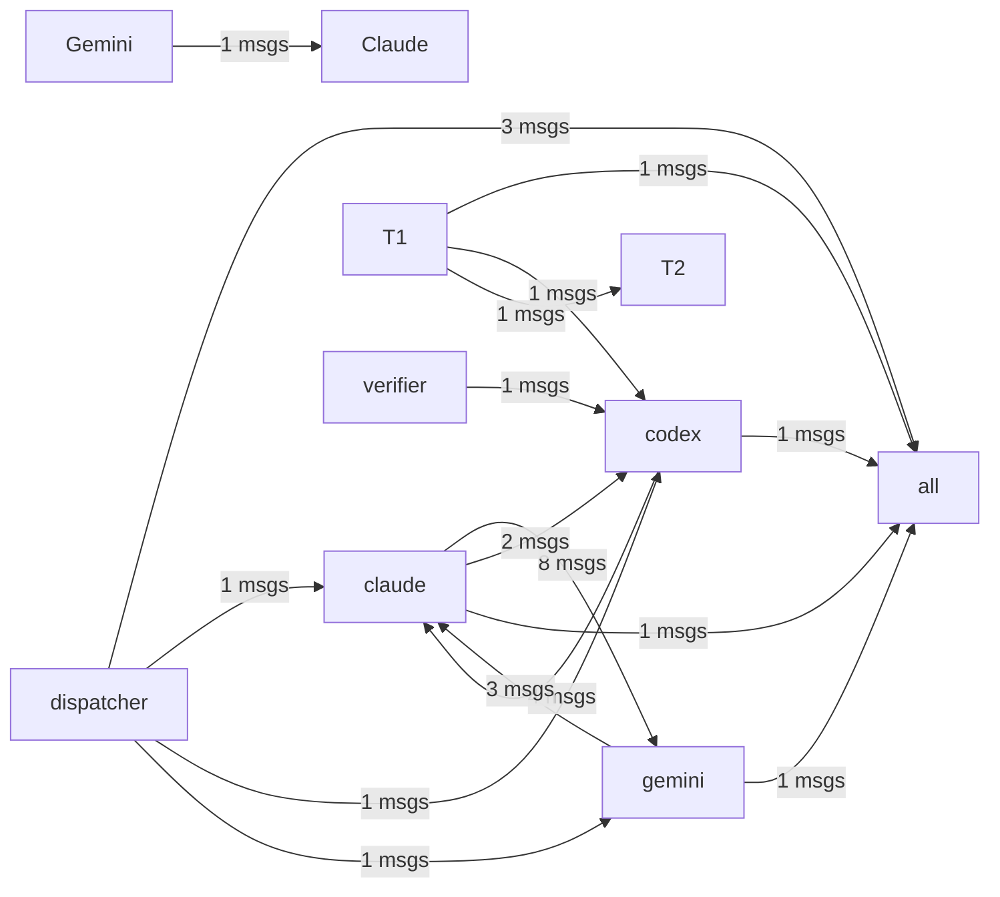

# HiveMind Status

Updated: `2026-03-17 19:32:06`

## Current Focus
No open plan tasks remain.

Alignment: Plan has no open tasks, but the workspace still has changes: .ai_monitor/bin/mcp_server.py, .ai_monitor/data/messages.jsonl, .ai_monitor/data/skill_results.jsonl, .claude/settings.local.json, hivemind.md (+9 more). Update ai_monitor_plan.md if this work is intentional.
Changed files:
- .ai_monitor/bin/mcp_server.py
- .ai_monitor/data/messages.jsonl
- .ai_monitor/data/skill_results.jsonl
- .claude/settings.local.json
- hivemind.md
- scripts/agent_shell.py
- scripts/auto_dispatcher.py
- scripts/cli_agent.py
- ... and 6 more

## Agent Flow

## Recent Thought Stream
- claude [file-edit]: 파일 수정: scripts\hive_hook.py
- claude [file-write]: 파일 생성: MEMORY.md
- gemini [file-edit]: File edited: .ai_monitor/bin/mcp_server.py
- claude [file-write]: 파일 생성: feedback_use_release_skill.md
- claude [session]: 세션 종료 [92c8e04f]
- gemini [file-edit]: File edited: vibe-coding/scripts/gemini_hook.py
- gemini [file-edit]: File edited: vibe-coding/scripts/itcp.py
- codex [debug,build,session]: ITCP hardening and Codex inbox injection

## Debate Ledger
- #8 [closed] round=1: codex smoke test 2 decision=smoke final decision
- #7 [open] round=1: codex smoke test
- #5 [closed] round=1: close 4 final decision decision=보안이 강화된 'close 4 final decision' 하이브리드 모델로 최종 합의됨.
- #6 [closed] round=1: post 4 1 gemini proposal body proposal decision=보안이 강화된 'post 4 1 gemini proposal body proposal' 하이브리드 모델로 최종 합의됨.
- #4 [closed] round=1: smoke test decision=보안이 강화된 'smoke test' 하이브리드 모델로 최종 합의됨.

---
> This file is generated by `scripts/generate_hivemind_doc.py`.
