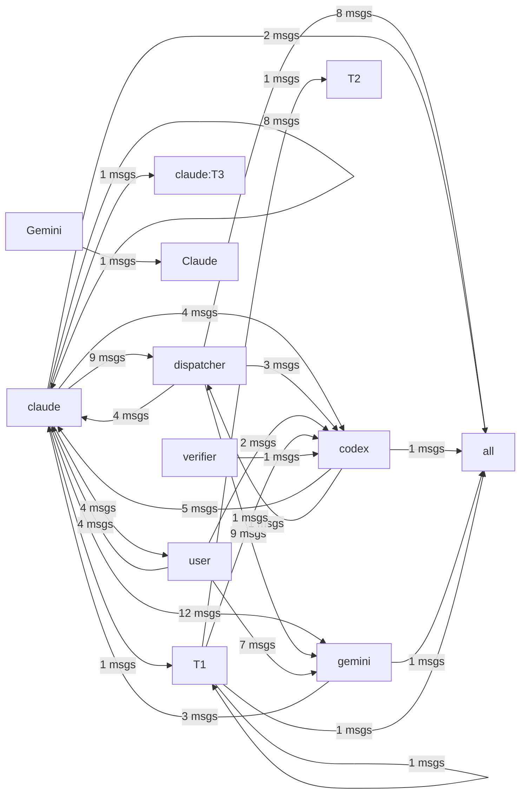

# HiveMind Status

Updated: `2026-03-24 22:14:03`

## Current Focus
Open plan tasks:
- Task 2: 채팅 세션 관리 모듈
  파일: `.ai_monitor/api/agent_api.py` (기존 파일에 추가)
  방법: _chat_sessions dict — 터미널별 session_id, 프로세스 핸들, 히스토리 관리.
- Task 3: ChatSlot.tsx 생성 — 메신저 스타일 채팅 UI
  파일: `.ai_monitor/vibe-view/src/components/ChatSlot.tsx` (신규)
  방법: - 헤더: 에이전트 이름 + 모델 선택 드롭다운 + YOLO 토글
- Task 4: TerminalSlot에 채팅/터미널 모드 토글 추가
  파일: `.ai_monitor/vibe-view/src/components/TerminalSlot.tsx`
  방법: - 에이전트 선택 카드에 "채팅 모드" / "터미널 모드" 토글 추가
- Task 5: Vite 빌드 + 동작 테스트
  파일: `.ai_monitor/vibe-view/`
  방법: npm run build → dist 생성 → 대시보드에서 채팅 모드 테스트

Alignment: Current work aligns best with Task 3: ChatSlot.tsx 생성 — 메신저 스타일 채팅 UI. Matched files: .ai_monitor/api/agent_api.py, .ai_monitor/api/config_api.py, .ai_monitor/api/pty_api.py, .ai_monitor/dashboard_window.py, .ai_monitor/pty-server/pty-server.js. Unmatched changes still present: %temp%/, .claude/settings.local.json, docs/terminal3_scroll_issue.md, hivemind.md, run_gemini.bat (+4 more).
Changed files:
- %temp%/
- .ai_monitor/api/agent_api.py
- .ai_monitor/api/config_api.py
- .ai_monitor/api/pty_api.py
- .ai_monitor/dashboard_window.py
- .ai_monitor/pty-server/pty-server.js
- .ai_monitor/requirements.txt
- .ai_monitor/server.py
- ... and 18 more

## Agent Flow

## Recent Thought Stream
- No recent thought records found.

## Debate Ledger
- #8 [closed] round=1: codex smoke test 2 decision=smoke final decision
- #7 [open] round=1: codex smoke test
- #5 [closed] round=1: close 4 final decision decision=보안이 강화된 'close 4 final decision' 하이브리드 모델로 최종 합의됨.
- #6 [closed] round=1: post 4 1 gemini proposal body proposal decision=보안이 강화된 'post 4 1 gemini proposal body proposal' 하이브리드 모델로 최종 합의됨.
- #4 [closed] round=1: smoke test decision=보안이 강화된 'smoke test' 하이브리드 모델로 최종 합의됨.

---
> This file is generated by `scripts/generate_hivemind_doc.py`.
