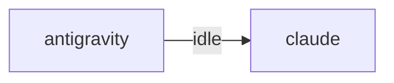

# HiveMind Status

Updated: `2026-08-09 09:18:03`

## Current Focus
Open plan tasks:
- Task 14: 작업 데이터 push   (의존: Task 11, 12)
  파일: scripts/apix_push.py
  방법: hive_tasks · 체크포인트 · 최근 커밋의 **변경분만** 전송(마지막 전송 커서).
- Task 15: 프로젝트별 보드   (의존: Task 14)
  파일: apix-console/console/panels/projects.js
  방법: 프로젝트별 카드 — 마지막 활동·진행 태스크·마지막 커밋·담당 노드.
- Task 16: GitHub 폴러
  파일: apix-console/collector/github_poller.py (cron 5분)
  방법: 최신 릴리즈·워크플로 실패를 apix_events 로. 토큰 사용(rate limit 회피).
- Task 17: 사고·교훈 패널   (의존: Task 14)
  파일: apix-console/console/panels/incidents.js
  검증: incident.py record 직후 콘솔에 나타난다.
- Task 18: na2js · qeuhlak · lenovo · 탭 · CipherTrader 노드에 푸시 배포
  방법: 노드별 개별 토큰 발급. 노드마다 검증 후 다음으로.
  검증: 콘솔 노드 목록에 전부 살아 있고, 한 대를 끄면 그 한 대만 회색이 된다.

Alignment: Current work aligns best with Task 26: central_api.py — 대화만. 원격 실행은 절대 넣지 않는다. Matched files: .ai_monitor/api/central_api.py, .ai_monitor/src/central_listener.py, .ai_monitor/src/pg_central.py, tests/test_central_messaging.py. Unmatched changes still present: .ai_monitor/infra/daemons.py, .ai_monitor/server.py, .ai_monitor/vibe-view/dist/assets/floatingwindow--ho84gjj.js, .ai_monitor/vibe-view/dist/assets/floatingwindow-0s1b6f_d.js, .ai_monitor/vibe-view/dist/assets/floatingwindow-9xjfhv3b.js (+364 more).
Changed files:
- .ai_monitor/api/central_api.py
- .ai_monitor/infra/daemons.py
- .ai_monitor/server.py
- .ai_monitor/src/central_listener.py
- .ai_monitor/src/pg_central.py
- .ai_monitor/vibe-view/dist/assets/floatingwindow--ho84gjj.js
- .ai_monitor/vibe-view/dist/assets/floatingwindow-0s1b6f_d.js
- .ai_monitor/vibe-view/dist/assets/floatingwindow-9xjfhv3b.js
- ... and 365 more

## Agent Flow

## Recent Thought Stream
- No recent thought records found.

## Debate Ledger
- No debates recorded yet.

## Data Warnings
- psycopg2 query failed: relation "hive_debates" does not exist
LINE 3:         FROM hive_debates
                     ^

- ERROR:  relation "hive_debates" does not exist
�� 2:         FROM hive_debates
                  ^
- psycopg2 query failed: relation "pg_messages" does not exist
LINE 3:         FROM pg_messages
                     ^

- ERROR:  relation "pg_messages" does not exist
�� 2:         FROM pg_messages
                  ^

---
> This file is generated by `scripts/generate_hivemind_doc.py`.
