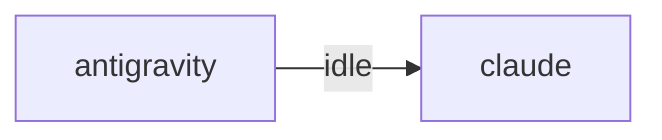

# HiveMind Status

Updated: `2026-08-15 15:03:12`

## Current Focus
No open plan tasks remain.

Alignment: Plan has no open tasks, but the workspace still has changes: .local/, ai_monitor_plan.md, hivemind.md, project_map.md, scripts/wiki_build.py (+44 more). Update ai_monitor_plan.md if this work is intentional.
Changed files:
- .local/
- ai_monitor_plan.md
- hivemind.md
- project_map.md
- scripts/wiki_build.py
- scripts/wiki_lint.py
- wiki//354/213/234/354/212/244/355/205/234//353/213/244/353/245/270 /355/224/204/353/241/234/354/240/235/355/212/270.md
- wiki//354/213/234/354/212/244/355/205/234//353/215/260/353/252/254/352/263/274 /354/275/230/354/206/224 /354/260/275.md
- ... and 41 more

## Agent Flow

## Recent Thought Stream
- No recent thought records found.

## Debate Ledger
- No debates recorded yet.

## Data Warnings
- psycopg2 query failed: relation "hive_debates" does not exist
LINE 3:         FROM hive_debates
                     ^

- ERROR:  relation "hive_debates" does not exist
�� 2:         FROM hive_debates
                  ^
- psycopg2 query failed: relation "pg_messages" does not exist
LINE 3:         FROM pg_messages
                     ^

- ERROR:  relation "pg_messages" does not exist
�� 2:         FROM pg_messages
                  ^

---
> This file is generated by `scripts/generate_hivemind_doc.py`.
