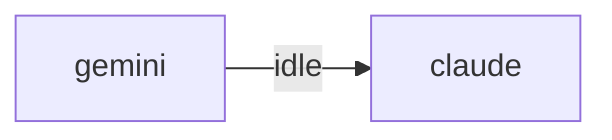

# HiveMind Status

Updated: `2026-06-11 19:42:28`

## Current Focus
No open plan tasks remain.

Alignment: Plan has no open tasks, but the workspace still has changes: gemini_statusline.py, hivemind.md, project_map.md, scripts/antigravity_hook.py, scripts/antigravity_output_filter.py (+4 more). Update ai_monitor_plan.md if this work is intentional.
Changed files:
- gemini_statusline.py
- hivemind.md
- project_map.md
- scripts/antigravity_hook.py
- scripts/antigravity_output_filter.py
- scripts/antigravity_session_repair.py
- scripts/run_antigravity_clean.py
- scripts/statusline.py
- ... and 1 more

## Agent Flow

## Recent Thought Stream
- No recent thought records found.

## Debate Ledger
- No debates recorded yet.

## Data Warnings
- psycopg2 query failed: relation "hive_debates" does not exist
LINE 3:         FROM hive_debates
                     ^

- ERROR:  relation "hive_debates" does not exist
�� 2:         FROM hive_debates
                  ^
- psycopg2 query failed: relation "pg_messages" does not exist
LINE 3:         FROM pg_messages
                     ^

- ERROR:  relation "pg_messages" does not exist
�� 2:         FROM pg_messages
                  ^

---
> This file is generated by `scripts/generate_hivemind_doc.py`.
