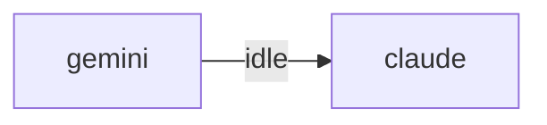

# HiveMind Status

Updated: `2026-06-07 11:31:35`

## Current Focus
No open plan tasks remain.

Alignment: Plan has no open tasks, but the workspace still has changes: .claude/commands/vibe-brainstorm.md, .claude/commands/vibe-code-review.md, .claude/commands/vibe-debug.md, .claude/commands/vibe-execute-plan.md, .claude/commands/vibe-heal.md (+16 more). Update ai_monitor_plan.md if this work is intentional.
Changed files:
- .claude/commands/vibe-brainstorm.md
- .claude/commands/vibe-code-review.md
- .claude/commands/vibe-debug.md
- .claude/commands/vibe-execute-plan.md
- .claude/commands/vibe-heal.md
- .claude/commands/vibe-orchestrate.md
- .claude/commands/vibe-release.md
- .claude/commands/vibe-security.md
- ... and 13 more

## Agent Flow

## Recent Thought Stream
- No recent thought records found.

## Debate Ledger
- No debates recorded yet.

## Data Warnings
- psycopg2 query failed: relation "hive_debates" does not exist
LINE 3:         FROM hive_debates
                     ^

- ERROR:  relation "hive_debates" does not exist
�� 2:         FROM hive_debates
                  ^
- psycopg2 query failed: relation "pg_messages" does not exist
LINE 3:         FROM pg_messages
                     ^

- ERROR:  relation "pg_messages" does not exist
�� 2:         FROM pg_messages
                  ^

---
> This file is generated by `scripts/generate_hivemind_doc.py`.
