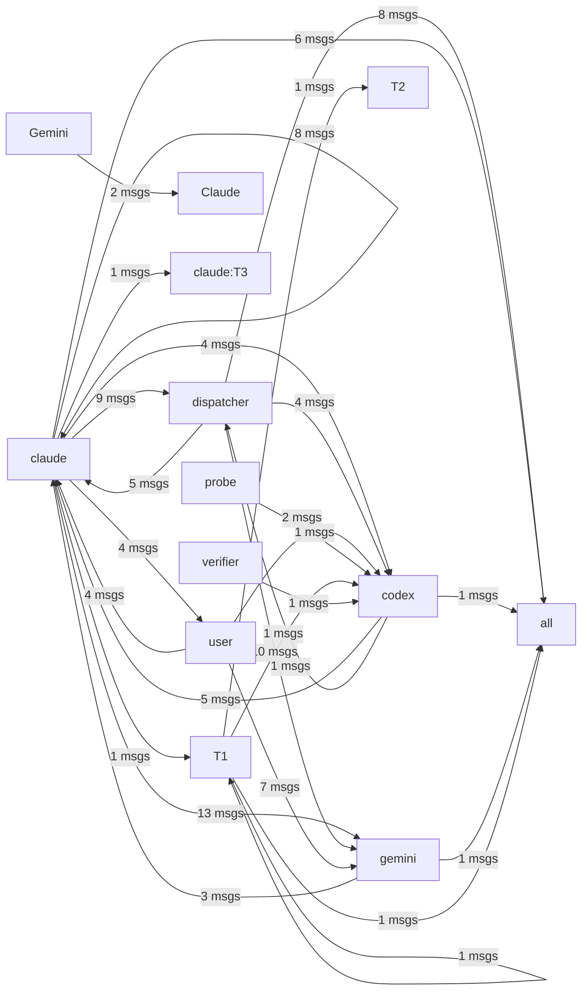

# HiveMind Status

Updated: `2026-03-31 00:09:06`

## Current Focus
Open plan tasks:
- Task 1: hive_tasks 테이블에 하트비트/체크아웃 컬럼 추가
  파일: .ai_monitor/src/pg_store.py (ensure_schema 함수, ~line 369)
  방법: ALTER TABLE로 parent_id, checkout_by, checkout_at, result 컬럼 추가
- Task 2: task_comments 테이블 생성
  파일: .ai_monitor/src/pg_store.py (ensure_schema 함수)
  방법: CREATE TABLE task_comments (id SERIAL, task_id TEXT REFERENCES hive_tasks,
- Task 3: agent_heartbeats 테이블 생성
  파일: .ai_monitor/src/pg_store.py (ensure_schema 함수)
  방법: CREATE TABLE agent_heartbeats (agent_id TEXT PK, status TEXT, last_beat TIMESTAMPTZ,
- Task 4: NOTIFY 트리거 생성
  파일: .ai_monitor/src/pg_store.py (ensure_schema 함수)
  방법: CREATE FUNCTION notify_task_assigned() — hive_tasks의 assigned_to 변경 시
- Task 5: pg_store.py에 원자적 체크아웃 함수 추가
  파일: .ai_monitor/src/pg_store.py
  방법: atomic_checkout(agent_id, task_id) — SELECT ... FOR UPDATE SKIP LOCKED로

Alignment: Current work aligns best with Task 14: AgentMonitorPanel 신규 작성. Matched files: .ai_monitor/api/tasks_api.py, .ai_monitor/bin/codex_wrapper.py, .ai_monitor/server.py, .ai_monitor/src/pg_store.py, .ai_monitor/vibe-view/dist/index.html. Unmatched changes still present: .claude/agent-memory/, .mcp.json, chat.jsonl, hivemind.md, last_python_cmd.txt (+20 more).
Changed files:
- .ai_monitor/api/tasks_api.py
- .ai_monitor/bin/codex_wrapper.py
- .ai_monitor/server.py
- .ai_monitor/src/pg_store.py
- .ai_monitor/vibe-view/dist/index.html
- .ai_monitor/vibe-view/src/app.tsx
- .ai_monitor/vibe-view/src/components/panels/agentmonitorpanel.tsx
- .ai_monitor/vibe-view/src/components/panels/groupchatpanel.tsx
- ... and 29 more

## Agent Flow

## Recent Thought Stream
- No recent thought records found.

## Debate Ledger
- #8 [closed] round=1: codex smoke test 2 decision=smoke final decision
- #7 [open] round=1: codex smoke test
- #5 [closed] round=1: close 4 final decision decision=보안이 강화된 'close 4 final decision' 하이브리드 모델로 최종 합의됨.
- #6 [closed] round=1: post 4 1 gemini proposal body proposal decision=보안이 강화된 'post 4 1 gemini proposal body proposal' 하이브리드 모델로 최종 합의됨.
- #4 [closed] round=1: smoke test decision=보안이 강화된 'smoke test' 하이브리드 모델로 최종 합의됨.

---
> This file is generated by `scripts/generate_hivemind_doc.py`.
