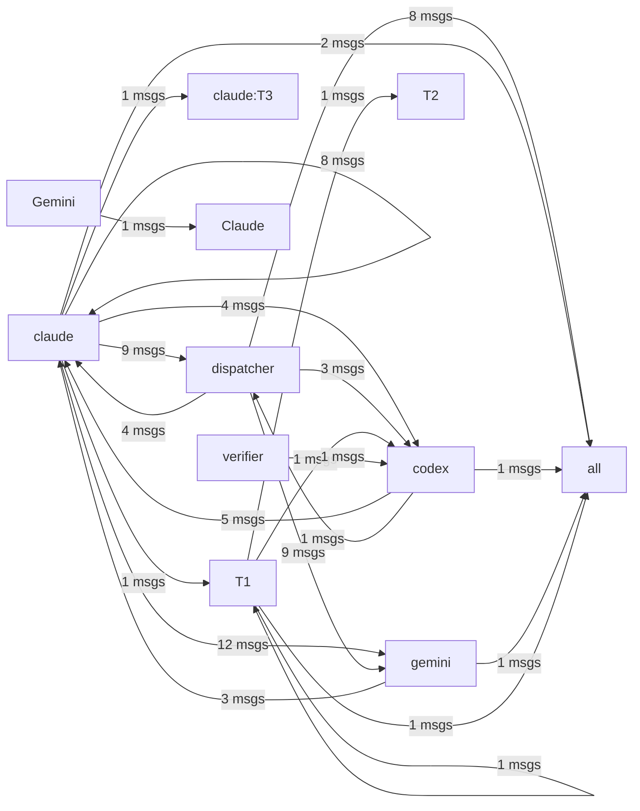

# HiveMind Status

Updated: `2026-03-22 23:40:19`

## Current Focus
No open plan tasks remain.

Alignment: Plan has no open tasks, but the workspace still has changes: .ai_monitor/config.json, .ai_monitor/server.py, .geminiignore, hivemind.md, run_gemini.bat (+5 more). Update ai_monitor_plan.md if this work is intentional.
Changed files:
- .ai_monitor/config.json
- .ai_monitor/server.py
- .geminiignore
- hivemind.md
- run_gemini.bat
- scripts/agent_launcher.py
- scripts/agent_shell.py
- scripts/gemini_output_filter.py
- ... and 2 more

## Agent Flow

## Recent Thought Stream
- No recent thought records found.

## Debate Ledger
- #8 [closed] round=1: codex smoke test 2 decision=smoke final decision
- #7 [open] round=1: codex smoke test
- #5 [closed] round=1: close 4 final decision decision=보안이 강화된 'close 4 final decision' 하이브리드 모델로 최종 합의됨.
- #6 [closed] round=1: post 4 1 gemini proposal body proposal decision=보안이 강화된 'post 4 1 gemini proposal body proposal' 하이브리드 모델로 최종 합의됨.
- #4 [closed] round=1: smoke test decision=보안이 강화된 'smoke test' 하이브리드 모델로 최종 합의됨.

---
> This file is generated by `scripts/generate_hivemind_doc.py`.
