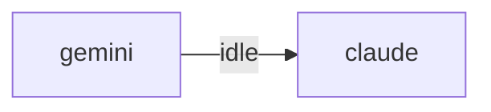

# HiveMind Status

Updated: `2026-04-22 22:35:00`

## Current Focus
No open plan tasks remain.

Alignment: Plan has no open tasks, but the workspace still has changes: .ai_monitor/server.py, .ai_monitor/src/zettelkasten.py, ceo_design_result.png, h2testw_1.4.zip, hivemind.md (+67 more). Update ai_monitor_plan.md if this work is intentional.
Changed files:
- .ai_monitor/server.py
- .ai_monitor/src/zettelkasten.py
- ceo_design_result.png
- h2testw_1.4.zip
- hivemind.md
- office_check.png
- office_check2.png
- office_check3.png
- ... and 64 more

## Agent Flow

## Recent Thought Stream
- No recent thought records found.

## Debate Ledger
- No debates recorded yet.

## Data Warnings
- psycopg2 query failed: relation "hive_debates" does not exist
LINE 3:         FROM hive_debates
                     ^

- ERROR:  relation "hive_debates" does not exist
�� 2:         FROM hive_debates
                  ^
- psycopg2 query failed: relation "pg_messages" does not exist
LINE 3:         FROM pg_messages
                     ^

- ERROR:  relation "pg_messages" does not exist
�� 2:         FROM pg_messages
                  ^

---
> This file is generated by `scripts/generate_hivemind_doc.py`.
