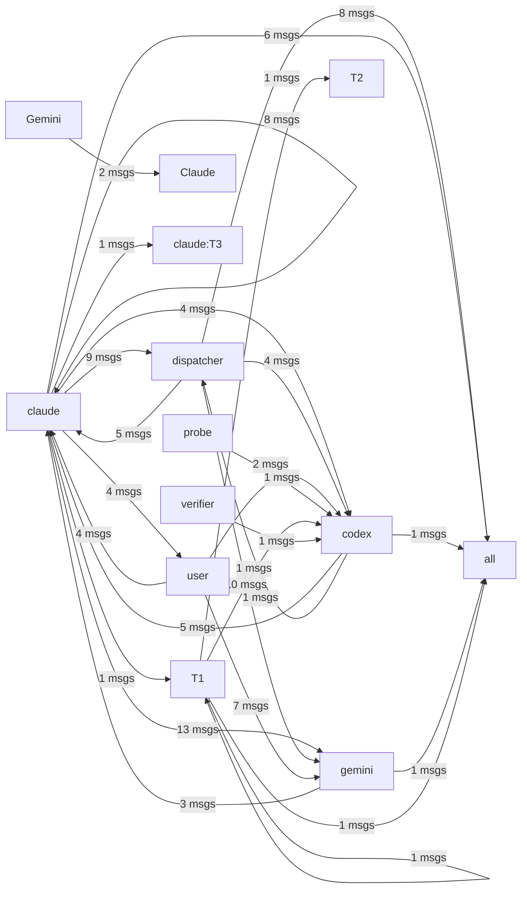

# HiveMind Status

Updated: `2026-04-16` (수동 검증 — Phase 2 정직성 확보)

## Current Focus

> 아래 태스크들은 모두 구현 완료됨 (pg_store.py에 반영 확인, 2026-04-16 검증)

- ~~Task 1: hive_tasks 체크아웃 컬럼~~ ✅ checkout_by, checkout_at 구현됨
- ~~Task 2: task_comments 테이블~~ ✅ 구현됨
- ~~Task 3: agent_heartbeats 테이블~~ ✅ 구현됨 + namespace 컬럼 추가
- ~~Task 4: NOTIFY 트리거~~ ✅ 구현됨
- ~~Task 5: atomic_checkout() 함수~~ ✅ 구현됨 + release_checkout() 포함

### 진행 중인 계획
- Phase 2: 시스템 정직성 확보 (gemini/codex 라벨링, stale 청소)
- Phase 3~5: [memory/project_hive_5phase_plan.md 참조]

## Agent 지원 현황
| Agent | 상태 | 비고 |
|-------|------|------|
| Claude | ✅ 완전 통합 | T1 터미널, 모든 역할 수행 |
| Gemini | 🧪 실험적 | 디스패처 프로필만 구현, CLI 자동 실행 미완성 |
| Codex | 🧪 실험적 | codex_enabled 플래그로 게이팅, CLI 자동 실행 미완성 |

## Agent Flow

## Recent Thought Stream
- No recent thought records found.

## Debate Ledger
- #8 [closed] round=1: codex smoke test 2 decision=smoke final decision
- #7 [closed] round=1: codex smoke test — codex 실험적 상태로 격하 (Phase 2)
- #5 [closed] round=1: close 4 final decision decision=보안이 강화된 'close 4 final decision' 하이브리드 모델로 최종 합의됨.
- #6 [closed] round=1: post 4 1 gemini proposal body proposal decision=보안이 강화된 'post 4 1 gemini proposal body proposal' 하이브리드 모델로 최종 합의됨.
- #4 [closed] round=1: smoke test decision=보안이 강화된 'smoke test' 하이브리드 모델로 최종 합의됨.

---
> This file is generated by `scripts/generate_hivemind_doc.py`.
