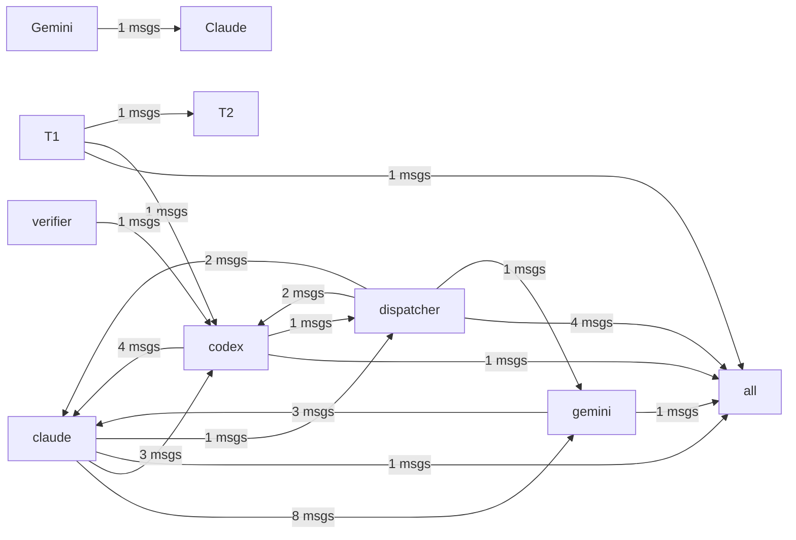

# HiveMind Status

Updated: `2026-03-18 08:22:03`

## Current Focus
No open plan tasks remain.

Alignment: Plan has no open tasks, but the workspace still has changes: hivemind.md. Update ai_monitor_plan.md if this work is intentional.
Changed files:
- hivemind.md

## Agent Flow

## Recent Thought Stream
- claude [session]: 세션 종료 [8224bb0f]
- claude [task-start]: [T0] 새 작업 수신
- claude [task-start]: [1] 새 작업 수신
- claude [session]: 세션 종료 [13b789c7]
- claude [git]: Git 커밋
- claude [file-edit]: 파일 수정: .github\workflows\build-release.yml
- claude [task-start]: [1] 새 작업 수신
- claude [session]: 세션 종료 [13b789c7]

## Debate Ledger
- #8 [closed] round=1: codex smoke test 2 decision=smoke final decision
- #7 [open] round=1: codex smoke test
- #5 [closed] round=1: close 4 final decision decision=보안이 강화된 'close 4 final decision' 하이브리드 모델로 최종 합의됨.
- #6 [closed] round=1: post 4 1 gemini proposal body proposal decision=보안이 강화된 'post 4 1 gemini proposal body proposal' 하이브리드 모델로 최종 합의됨.
- #4 [closed] round=1: smoke test decision=보안이 강화된 'smoke test' 하이브리드 모델로 최종 합의됨.

---
> This file is generated by `scripts/generate_hivemind_doc.py`.
