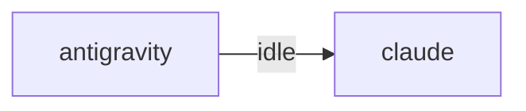

# HiveMind Status

Updated: `2026-08-12 20:52:44`

## Current Focus
No open plan tasks remain.

Alignment: Plan has no open tasks, but the workspace still has changes: .ai_monitor/vibe-view/dist/assets/floatingwindow-c1-5laty.js, .ai_monitor/vibe-view/dist/assets/index-dpl6wkca.css, .ai_monitor/vibe-view/dist/assets/index-opg_x30l.js, .ai_monitor/vibe-view/dist/assets/officeapp-dnkow1pl.js, .ai_monitor/vibe-view/dist/index.html (+4 more). Update ai_monitor_plan.md if this work is intentional.
Changed files:
- .ai_monitor/vibe-view/dist/assets/floatingwindow-c1-5laty.js
- .ai_monitor/vibe-view/dist/assets/index-dpl6wkca.css
- .ai_monitor/vibe-view/dist/assets/index-opg_x30l.js
- .ai_monitor/vibe-view/dist/assets/officeapp-dnkow1pl.js
- .ai_monitor/vibe-view/dist/index.html
- .gitignore
- .gitignore.bak
- hivemind.md
- ... and 1 more

## Agent Flow

## Recent Thought Stream
- No recent thought records found.

## Debate Ledger
- No debates recorded yet.

## Data Warnings
- psycopg2 query failed: relation "hive_debates" does not exist
LINE 3:         FROM hive_debates
                     ^

- ERROR:  relation "hive_debates" does not exist
�� 2:         FROM hive_debates
                  ^
- psycopg2 query failed: relation "pg_messages" does not exist
LINE 3:         FROM pg_messages
                     ^

- ERROR:  relation "pg_messages" does not exist
�� 2:         FROM pg_messages
                  ^

---
> This file is generated by `scripts/generate_hivemind_doc.py`.
