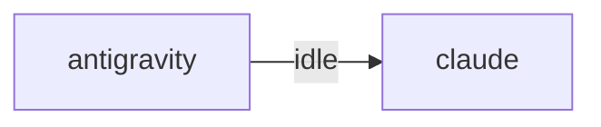

# HiveMind Status

Updated: `2026-08-10 00:16:14`

## Current Focus
Open plan tasks:
- Task 15: 프로젝트별 보드   (의존: Task 14)
  파일: apix-console/console/panels/projects.js
  방법: 프로젝트별 카드 — 마지막 활동·진행 태스크·마지막 커밋·담당 노드.
- Task 16: GitHub 폴러
  파일: apix-console/collector/github_poller.py (cron 5분)
  방법: 최신 릴리즈·워크플로 실패를 apix_events 로. 토큰 사용(rate limit 회피).
- Task 17: 사고·교훈 패널   (의존: Task 14)
  파일: apix-console/console/panels/incidents.js
  검증: incident.py record 직후 콘솔에 나타난다.
- Task 18: na2js · qeuhlak · lenovo · 탭 · CipherTrader 노드에 푸시 배포
  방법: 노드별 개별 토큰 발급. 노드마다 검증 후 다음으로.
  검증: 콘솔 노드 목록에 전부 살아 있고, 한 대를 끄면 그 한 대만 회색이 된다.
- Task 32: 신규 노드 온보딩 절차 — 키 발급→permitopen 등록→config 주입을 스크립트 1개로
  (지금은 수작업. 다른 PC를 붙이려면 이게 먼저다)

Alignment: Changed files do not map to any open plan task. Current changes: project_map.md.
Changed files:
- project_map.md

## Agent Flow

## Recent Thought Stream
- No recent thought records found.

## Debate Ledger
- No debates recorded yet.

## Data Warnings
- psycopg2 query failed: relation "hive_debates" does not exist
LINE 3:         FROM hive_debates
                     ^

- ERROR:  relation "hive_debates" does not exist
�� 2:         FROM hive_debates
                  ^
- psycopg2 query failed: relation "pg_messages" does not exist
LINE 3:         FROM pg_messages
                     ^

- ERROR:  relation "pg_messages" does not exist
�� 2:         FROM pg_messages
                  ^

---
> This file is generated by `scripts/generate_hivemind_doc.py`.
